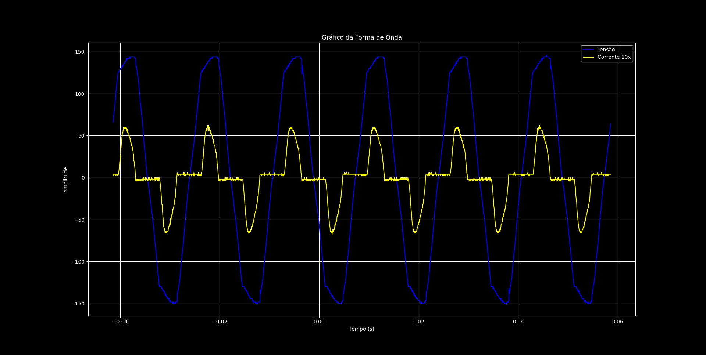
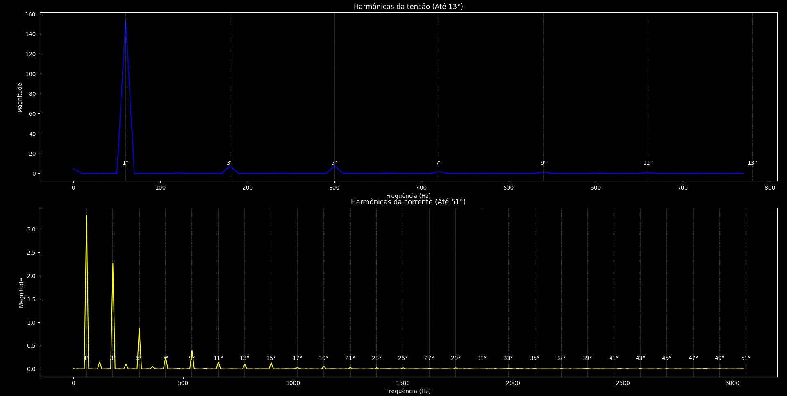

# Análise das harmônicas de um Retificador Monofásico Ponte Completa com Filtro Capacitivo em PYTHON

## Descrição do Projeto
Este projeto visa analisar os aspectos de um retificador monofásico ponte completa com filtro capacitivo. A análise inclui o cálculo do fator de potência, fator de deslocamento, THD (distorção harmônica total) da tensão e da corrente, e a identificação das componentes harmônicas ímpares. O objetivo principal é entender a influência das harmônicas em sistemas elétricos, comprovando resultados por meio de cálculos, gráficos e comparações.

## Estrutura do Projeto
- **Código Python**: Realiza os cálculos e plotagens dos gráficos necessários para a análise.
- **Arquivos CSV**: Contêm os dados de tensão e corrente, coletados via osciloscópio, usados nas simulações e cálculos.
- **Relatório de Análise**: Fornece uma visão detalhada dos resultados e conclusões obtidos a partir dos dados simulados.

## Funcionalidades Principais
1. **Análise no Domínio da Frequência**:
   - Cálculo e plotagem do espectro de frequência (Transformada de Fourier) para tensão e corrente, com foco nas harmônicas ímpares.
2. **Cálculo do Fator de Potência**:
   - Cálculo do fator de potência, com separação da potência ativa e aparente.
3. **THD da Tensão e Corrente**:
   - Cálculo da distorção harmônica total (THD) para ambas as formas de onda.
4. **Fator de Deslocamento**:
   - Determinação do fator de deslocamento da corrente em relação à tensão.

## Requisitos
- Python 3.x
- Bibliotecas:
  - `pandas`
  - `numpy`
  - `matplotlib`

## Como Usar
1. Clone o repositório:
   ```bash
   git clone https://github.com/seu-usuario/seu-repositorio.git
   ```
2. Instale as bibliotecas necessárias:
   ```bash
   pip install numpy
   ```

    ```bash
   pip install pandas
   ```
    
    ```bash
   pip install matplotlib
   ```
    
3. Execute o script principal:
   ```bash
   python ArquivoPython.py
   ```

## Resultados Obtidos

### Gráfico de Tensão e Corrente


### Gráfico de Harmônicas


- **Fator de Potência**: 0,7480
- **THD da Tensão**: 7,08%
- **THD da Corrente**: 75,58%
- **Fator de Deslocamento**: 0,9376

## Conclusão

A análise de um retificador de ponte completa com filtro capacitivo realizada neste trabalho forneceu importantes insights sobre o comportamento do circuito em termos de qualidade de energia e eficiência. A partir dos dados coletados por meio de uma simulação e processados em Python, foram determinados vários parâmetros essenciais: o valor RMS da tensão e da corrente, a potência ativa e aparente, o fator de potência, o THD (Total Harmonic Distortion) da tensão e da corrente, e o fator de deslocamento entre a corrente e a tensão.

Os resultados obtidos mostraram que a tensão apresenta uma distorção harmônica relativamente baixa, com THD de 7,08%, o que é coerente para circuitos com filtro capacitivo, onde a tensão é suavizada pelo capacitor, aproximando-se de uma forma de onda contínua com menor ondulação. Já a corrente possui um THD elevado de 75,58%, reflexo da forma pulsada e altamente distorcida da corrente devido ao comportamento de carga do capacitor, que resulta em picos de corrente concentrados em períodos específicos do ciclo. Esse alto THD indica a presença de várias harmônicas na forma de onda da corrente, o que é típico em retificadores com filtro capacitivo, e é evidenciado no gráfico de análise harmônica, onde as harmônicas superiores são predominantes.

O fator de potência (FP) de 0,7480 também reflete a elevada distorção na corrente. Esse valor indica que o circuito utiliza apenas 74,8% da potência aparente para realizar trabalho útil (potência ativa), enquanto o restante está associado a componentes reativas e harmônicas. O fator de deslocamento da corrente em relação à tensão de 0,9376, próximo de 1, indica que a defasagem angular entre as componentes fundamentais da corrente e da tensão é relativamente pequena, sendo a distorção a principal causa do baixo fator de potência.

Esses resultados são esperados em retificadores de ponte completa com filtro capacitivo, e são consistentes com um circuito que apresenta elevado ripple na corrente e baixa eficiência no uso de potência. Em um projeto real, a alta distorção harmônica na corrente pode impactar negativamente a qualidade da energia e os componentes do sistema, exigindo cuidado no dimensionamento dos diodos, do capacitor e do transformador para suportar os picos de corrente e as oscilações. Além disso, o alto THD da corrente e o baixo fator de potência podem requerer compensação em ambientes industriais, como o uso de filtros harmônicos ou correção de fator de potência.

Portanto, os resultados obtidos são coerentes com o comportamento esperado de um retificador de ponte com filtro capacitivo. A análise fornece uma visão detalhada das implicações do circuito na qualidade da energia e na eficiência do sistema, destacando a importância de um dimensionamento adequado dos componentes e possíveis ações de mitigação de harmônicas para melhorar o desempenho do circuito em aplicações reais.

